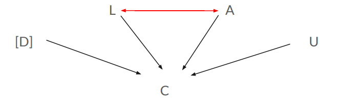

# Bayesian Hierarchical Modeling

This repository contains a Bayesian hierarchical logistic regression project developed for the Bayesian Methods course at Lund University.

The project models contraceptive use among Bangladeshi women using Bayesian fixed-effects and hierarchical logistic regression models implemented in Stan. Model performance is evaluated using WAIC, posterior predictive checks, and counterfactual analysis.

  

**Figure 1.** Final Bayesian hierarchical logistic regression model with district-level effects and an interaction between age and living children.

## Workflow

1. Load Bangladesh Fertility Survey
2. Build Bayesian logistic regression models
3. Develop hierarchical model
4. Compare models using WAIC
5. Perform posterior predictive checks
6. Conduct counterfactual analysis

## Project Overview

Three Bayesian logistic regression models were developed and compared:

- Fixed-effects logistic regression
- Bayesian hierarchical logistic regression
- Bayesian hierarchical logistic regression with an interaction between age and living children

The final model was selected based on WAIC and posterior diagnostics, and further evaluated through posterior predictive checks and counterfactual analysis.

## Dataset

The analysis uses the `bangladesh` dataset from the 1989 Bangladesh Fertility Survey, which contains data from **1,934 women**.

The variables used in the analysis are:

- **C** – Contraceptive use (binary outcome)
- **D** – District of residence (grouping variable)
- **L** – Number of living children
- **A** – Standardized centered age
- **U** – Urban residence (0 = Rural, 1 = Urban)

The dataset includes only women with at least one living child.
