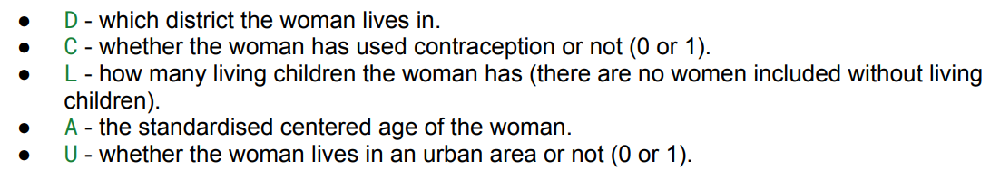

# Bayesian Hierarchical Modeling
This repository contains a Bayesian hierarchical logistic regression project developed for the Bayesian Methods course at Lund University.
The project models contraceptive use among Bangladeshi women using fixed-effects and multilevel Bayesian models implemented in Stan. Multiple model specifications were compared using posterior diagnostics and WAIC to identify the best-performing model.
## Workflow
1. Load Bangladesh Fertility Survey
2. Build Bayesian Logistic Regression
3. Develop Hierarchical Model
4. Compare Models using WAIC
5. Posterior Prediction
6. Counterfactual Analysis
## Bayesian Hierarchical Model

  

  

**Figure 1.** Final Bayesian hierarchical logistic regression model with district-level effects and an interaction between age and living children.
